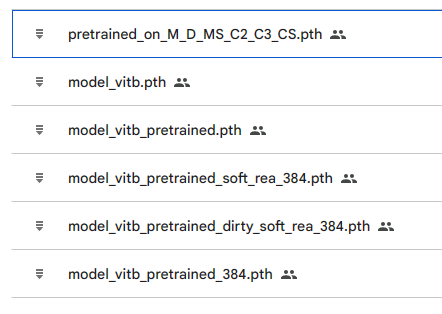

## [2024 ICME Grand Challenge: Multi-Modal Video Reasoning and Analyzing Competition (MMVRAC)](https://sutdcv.github.io/MMVRAC/)

dataset: [UAVhuman-reid](https://github.com/sutdcv/UAV-Human)

The ultimate results of our method is 82.2(mAP), 81.3(Rank-1), 93.3(Rank-5).

### 1. configurations
First of all, create a conda env, then install packages detailed in enviroments.sh. Make sure that the cuda version of your machine matches the one in enviroments.sh (otherwise modify it into the one compatible with your machine).
```
conda create -n reid python==3.9
conda activate reid
bash enviroments.sh
```

Note that, all experiments are conducted using single GPU: NVIDIA Titan RTX or A6000.

### 2. downloading pretrained model on Market+DukeMTMC+MSMT17+cuhk02+cuhk03+CUHK-SYSU.
model link: https://drive.google.com/drive/folders/15_afl7WAKBJMuGXQKsVM4VzWrwZcSs7R?usp=sharing



The first one is the pretrained model. Others are multiple models trained on uavhuman for ensemble.

### 3. training
We use the ViT-base/12 model pretrained on Market+DukeMTMC+MSMT17+cuhk02+cuhk03+CUHK-SYSU.

Furthermore, we add 7 tokens (like cls token) for attribute learning which largely improves the performance on uavhuman.

Modify the paths and settings in config/pretrained_vit.yml, then

```
python train.py --config_file config/#your_config_name#.yml
```

### 4. evaluation
We use multiple tricks to re-rank the ranking lists of queries, like re-ranking, rank fusion of multiple models. Besides, we use the setting of multi-shot query images to further improve the performance.

Modify the model paths in test_ensemble.py as your trained model path, then

```
python test_ensemble.py
```

### 5. results
As detailed in test_ensemble.py, 5 distinct models are used for the ultimate performance. Their performances are shown below:

| multi-query setting          | mAP    | Rank-1 | Rank-5 | (mAP+R1)/2 |
| ---------------------------- | ------ | ------ | ------ | ---------- |
| 1. ViT-B/12(imagenet)        | 77.8   | 79.6   | 92.4   | 78.70      |
| 2. ViT-B/12(pretrained)      | 79.7   | 80.4   | 93.3   | 80.05      |
| 3. 2+384x192                 | 80.2   | 80.0   | 95.1   | 80.10      |
| 4. 3+soft REA                | 79.0   | 79.1   | 92.6   | 79.05      |
| 5. 4+dirty samples filtering | 79.5   | 80.6   | 92.6   | 80.05      |
| 1+2+3+4+5                    | 80.5   | 81.5   | 93.7   | 81.00      |
| 1+2+3+4+5(re-rank:4,4,0.45)  | **82.2**   | **81.3**   | **93.3**   | **81.75**      |